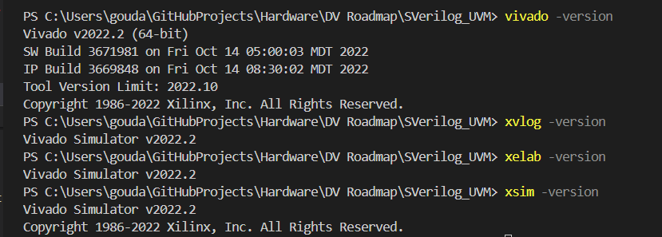
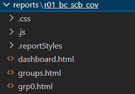
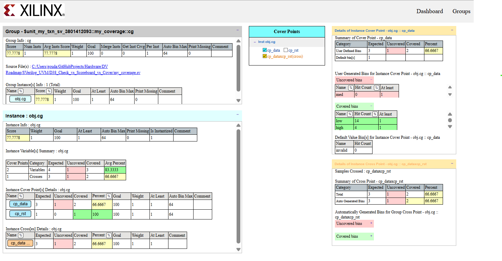

# 👨‍💻 SystemVerilog UVM Verification using Xilinx Vivado XSIM

This repository contains **SystemVerilog + UVM–based verification environments** simulated using **Xilinx Vivado XSIM**.
It demonstrates **industry-correct UVM compile flow**, **functional coverage generation**, and **regression-ready practices**.

The project is structured as multiple folders representing incremental learning, hands-on experiments, and verification patterns.
(Roadmap followed using ChatGPT.)

---

## Highlights
- End-to-end UVM verification flow on Vivado XSIM
- Blocking scoreboard using analysis FIFOs
- Factory and Config DB
- Predictor-based expected modeling
- Failure-mode driven verification (missing/extra/lag)
- Phase-aligned transaction sampling

---

# Vivado XSIM – Installation, Setup & Simulation Flow

This document describes how to install **Xilinx Vivado**, verify the setup, and run **SystemVerilog / UVM simulations using XSIM**, including coverage generation.

This README is **tool-focused** and applies to any Vivado-based verification project.

---

## 🛠️ Tools & Technologies

* **Simulator**: Xilinx Vivado XSIM
* **Language**: SystemVerilog
* **Methodology**: UVM (Universal Verification Methodology)
* **Coverage**: Functional Coverage (covergroups, coverpoints, crosses)
* **Debug**: XSIM debug database & waveforms

---

## ⏬ Vivado Installation

### 1️⃣ Download Vivado

Download Vivado from the official AMD/Xilinx website:

* Vivado Design Suite (WebPACK / ML / HL editions)
* Recommended version: **Vivado 2020.2 or later**

During installation, ensure:

* **Vivado Simulator (XSIM)** is selected
* Default UVM library is installed

---

## ⚙ Environment Setup

### 🪟Windows

**Vivado bin directory added to PATH**
* Check Vivado/bin path added to your environment variables.
* If not, check the bin directory created in your file system after installation.
```
C:\Vivado\20xx.x\bin
 (or)
C:\Vitis\Vivado\20xx.x\bin 
```
* Add this path to your environment variables.

All required tools (`xvlog`, `xelab`, `xsim`) are pre-configured.

---

### 🐧Linux

Source the Vivado settings script before running any command:

```sh
source /path/to/Vivado/<version>/settings64.sh
```

Example:

```sh
source /tools/Xilinx/Vivado/2023.1/settings64.sh
```

---

## 🔍 Version Check (CLI)

Verify installation and tool availability:

```sh
vivado -version
xvlog -version
xelab -version
xsim -version
```
Expected CLI output :


If any command is not found, the environment is not sourced correctly.

---

## ▶ XSIM Simulation Flow

XSIM follows a **three-step flow**:

```
Compile → Elaborate → Simulate
```

---

### 1️⃣ Compile (xvlog)

Compile SystemVerilog / UVM sources:

```sh
xvlog -sv -L uvm *.sv
```

For directories:

```sh
xvlog -sv -L uvm rtl/*.sv tb/*.sv
```

For source files list:
```sh
xvlog -sv -L uvm -f filelist.f
```

📌`-L uvm` is NOT required for pure System Verilog. 

📌`-L uvm` tells Vivado to link against its **built-in UVM library**.
Without it:
* `uvm_component`, `uvm_test`, `uvm_env` are **undefined**
* Compilation **fails**

---

### 2️⃣ Elaborate (xelab)

Elaborate the design and testbench:

```sh
xelab -L uvm tb_top -s sim_snapshot 
```

* `tb_top` → Top-level testbench module
* `sim_snapshot` → Compiled simulation snapshot

---

### 3️⃣ Simulate (xsim)

Run the simulation:

```sh
xsim sim_snapshot -sv_seed random -runall
```

Or interactively:

```sh
> xsim sim_snapshot -sv_seed random
xsim% run all
xsim% exit
```

📌 `-sv_seed random` is used to seed Randomization.

Simulation runs until:
* `$finish`, or
* all UVM objections are dropped

*Coverage database saved in Default directory: `xsim.covdb`*

---

## 📊 Functional Coverage Flow (XSIM)

XSIM supports **functional coverage collection** and **HTML report generation** using `xcrg`(Xilinx Coverage Report Generator).

More about `xcrg`, refer [UG937](https://docs.amd.com/r/en-US/ug937-vivado-design-suite-simulation-tutorial/Functional-Coverage).

---

### ✔ Run simulation with explicit coverage directory

```bash
xsim top -sv_seed random -cov_db_dir covdb_run_01 runall
```

#### 📌 Why explicit coverage directories matter

* Default directory: `xsim.covdb`
* For **regression**, each run must use a **separate DB**
* Prevents overwriting coverage data

➡️ Coverage database created at:

```text
covdb_run_01/
```

---

### 📈 Generate HTML Coverage Report

#### 1️⃣ Create reports directory

```bash
mkdir reports/run_01
```

#### 2️⃣ Generate report

```bash
xcrg -report_format html -dir covdb_run_01 -report_dir reports/run_01
```
* It creates the following files.



---

### 🌐 Open the report

Open in a browser:

```text
reports/run_01/dashboard.html
```
Go to `Groups -> Check group in Name column -> Instance`

The report includes:

* Covergroups & coverpoints
* Cross coverage
* Hit/miss statistics
* Coverage percentage summary

Example xcrg html report view:



---

## ⚠️ Notes

* UVM simulations may **block intentionally** depending on testbench behavior
* Hanging simulations can indicate:

  * Missing transactions
  * Blocking FIFOs
  * Incorrect objection handling
* Always review simulation logs carefully

---

## 📌 Compatibility Notes

* UVM version is provided by Vivado
* Assertion coverage not supported. (in 2022.X)
* Some advanced UVM features may differ across Vivado versions.
    (Check docs [*UG900*](https://docs.amd.com/r/en-US/ug900-vivado-logic-simulation/Universal-Verification-Methodology-UVM-Support) for UVM features supported, by AMD Vivado)
---

## ✅ Purpose

This setup is suitable for:

* RTL verification
* UVM-based testbenches
* Functional coverage collection
* Regression-style simulations using XSIM

---

## Show your support
Give a ⭐️ if this repo helped you!

---

> Note: Vivado™ and XSIM™ are trademarks of AMD/Xilinx.

> This repository is for educational and verification practice purposes only.
